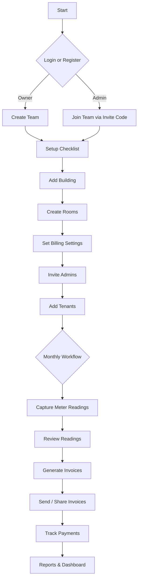

# StayKha


A modern dormitory and room management system with automated meter reading and billing capabilities. StayKha helps property owners manage buildings, rooms, tenants, capture monthly utility readings, and generate invoices seamlessly.

## Features

- **Building Management**: Create and manage multiple buildings with floor and room tracking
- **Room Management**: Track room status (occupied, vacant, maintenance), rent, and size with bulk creation support
- **Tenant Management**: Complete tenant profiles with contact information, move-in dates, contracts, and emergency contacts
- **Meter Readings**: Capture water and electric meter readings with photo uploads, grouped by room and month
- **Billing & Invoicing**: Automated invoice generation from meter readings with configurable rates and billing modes
- **Admin Management**: Multi-admin support with role-based access (owner/admin) and invitation system
- **Settings**: Configurable billing rates, company information, payment details (bank info, late payment penalties), Thai invoice labels, and default values
- **Dashboard**: Real-time overview with statistics, occupancy rates, and pending readings
- **Authentication**: Login, registration, and team onboarding (create or join a team)

## Tech Stack

### Frontend
- **React 19** - UI framework
- **Vite** - Build tool and dev server
- **TypeScript** - Type safety
- **TanStack Router** - Client-side routing
- **TanStack React Query** - Server state management
- **Radix UI** - Accessible component primitives
- **Tailwind CSS** - Utility-first styling
- **shadcn/ui** - Component library
- **Framer Motion** - Animations

### Backend
- **REST API** - Custom backend exposed under `/v1` with Bearer token auth

### Development Tools
- **Biome** - Linting and formatting
- **pnpm** - Package manager

## Prerequisites

- **Node.js** 18+ and **pnpm** installed
- **API server** running and reachable at `VITE_API_URL` (default: `http://localhost:3000`)
- Modern web browser

## Installation

1. Clone the repository:
```bash
git clone <repository-url>
cd staykha-app-nextjs
```

2. Install dependencies:
```bash
pnpm install
```

3. Create a `.env` file in the root directory:
```bash
VITE_API_URL=http://localhost:3000
```

4. Start the development server:
```bash
pnpm dev
```

5. Open your browser and navigate to `http://localhost:5173`

## Backend API Setup Guide

StayKha expects a REST API exposed under `/v1` with Bearer token authentication. Ensure your API provides endpoints for auth and the core resources (teams, buildings, rooms, tenants, readings, invoices, settings, admins, invitations).

Minimal requirements:
- `POST /v1/auth/login` returns `{ token, user }`
- `POST /v1/auth/register` returns `{ user }`
- Resource endpoints under `/v1/<resource>` (e.g., `/v1/rooms`, `/v1/invoices`)

For detailed field definitions and access rules, see [SETUP_GUIDE.md](./SETUP_GUIDE.md).

## User Flow Overview



## Entity Relationship Diagram

```mermaid
erDiagram
    Team ||--o{ User : "has"
    Team ||--o{ Building : "owns"
    Team ||--o{ Room : "contains"
    Team ||--o{ Tenant : "manages"
    Team ||--o{ MeterReadingGroup : "tracks"
    Team ||--o{ Invoice : "generates"
    Team ||--|| Settings : "configures"
    Team ||--o{ AdminInvitation : "sends"
    User ||--o{ Building : "owns"
    User ||--o{ AdminInvitation : "creates"
    Building ||--o{ Room : "contains"
    Room ||--o| Tenant : "occupied_by"
    Room ||--o{ MeterReadingGroup : "has_readings"
    MeterReadingGroup ||--o{ Invoice : "generates"
    Tenant ||--o{ Invoice : "receives"
    MeterReadingGroup ||--o| MeterReading : "water_reading"
    MeterReadingGroup ||--o| MeterReading : "electric_reading"
    MeterReading }o--|| Room : "belongs_to"
    MeterReading }o--o| Tenant : "for"

    Team {
        string id PK "Primary Key"
        string name "Team name"
        datetime createdAt "Creation timestamp"
        datetime updatedAt "Last update timestamp"
    }

    User {
        string id PK "Primary Key"
        string email UK "Unique email"
        string name "Full name"
        enum role "owner | admin"
        string teamId FK "Foreign Key to Team"
        datetime createdAt "Account creation"
    }

    Building {
        string id PK "Primary Key"
        string name "Building name"
        string address "Full address"
        int totalFloors "Number of floors"
        int totalRooms "Total room count"
        int occupiedRooms "Currently occupied"
        string ownerId FK "Foreign Key to User (owner)"
        string teamId FK "Foreign Key to Team"
        datetime createdAt "Creation timestamp"
        datetime updatedAt "Last update timestamp"
    }

    Room {
        string id PK "Primary Key"
        string roomNumber "Room identifier"
        string buildingId FK "Foreign Key to Building"
        int floor "Floor number"
        enum status "occupied | vacant | maintenance"
        decimal monthlyRent "Monthly rent amount"
        decimal size "Room size in sqm"
        string tenantId FK "Foreign Key to Tenant (nullable)"
        string teamId FK "Foreign Key to Team"
    }

    Tenant {
        string id PK "Primary Key"
        string name "Full name"
        string email "Contact email"
        string phone "Phone number"
        string roomId FK "Foreign Key to Room (nullable)"
        date moveInDate "Move-in date"
        date contractEndDate "Contract end date (nullable)"
        decimal monthlyRent "Monthly rent"
        decimal deposit "Security deposit"
        string idCardNumber "ID card number (optional)"
        string emergencyContact "Emergency contact name"
        string emergencyPhone "Emergency phone"
        enum status "active | inactive | expired"
        string teamId FK "Foreign Key to Team"
        datetime createdAt "Registration timestamp"
    }

    MeterReadingGroup {
        string id PK "Primary Key"
        string roomId FK "Foreign Key to Room"
        date readingDate "Date of reading"
        enum status "incomplete | pending | billed | paid"
        string teamId FK "Foreign Key to Team"
    }

    MeterReading {
        string id PK "Primary Key"
        string readingGroupId FK "Foreign Key to MeterReadingGroup (nullable)"
        string roomId FK "Foreign Key to Room"
        string tenantId FK "Foreign Key to Tenant (nullable)"
        enum meterType "water | electric"
        decimal previousReading "Previous meter value"
        decimal currentReading "Current meter value"
        decimal consumption "Calculated consumption"
        string previousPhotoUrl "Previous reading photo URL"
        string currentPhotoUrl "Current reading photo URL"
        date readingDate "Date of reading"
        enum status "pending | billed | paid"
        string createdBy FK "Foreign Key to User (nullable)"
    }

    Invoice {
        string id PK "Primary Key"
        string invoiceNumber UK "Unique invoice number"
        string tenantId FK "Foreign Key to Tenant (nullable)"
        string roomId FK "Foreign Key to Room"
        string readingGroupId FK "Foreign Key to MeterReadingGroup (nullable)"
        string billingPeriod "Billing period (e.g., 2024-01)"
        date issueDate "Invoice issue date"
        date dueDate "Payment due date"
        date paidDate "Payment date (nullable)"
        enum status "draft | sent | paid | pending | overdue"
        decimal waterUsage "Water usage amount (legacy)"
        decimal waterRate "Water rate (legacy)"
        decimal waterAmount "Water amount (legacy)"
        decimal electricUsage "Electric usage amount (legacy)"
        decimal electricRate "Electric rate (legacy)"
        decimal electricAmount "Electric amount (legacy)"
        decimal waterConsumption "Water usage amount"
        decimal waterRatePerUnit "Water rate per unit"
        decimal waterSubtotal "Water charges subtotal"
        decimal electricConsumption "Electric usage amount"
        decimal electricRatePerUnit "Electric rate per unit"
        decimal electricSubtotal "Electric charges subtotal"
        decimal roomRent "Monthly room rent"
        decimal subtotal "Subtotal before tax"
        decimal tax "Tax amount"
        decimal total "Final total amount"
        enum waterBillingMode "metered | fixed"
        decimal waterFixedFee "Fixed water fee (if applicable)"
        json readings "Meter reading details (JSON array)"
        string teamId FK "Foreign Key to Team"
        datetime createdAt "Invoice creation timestamp"
    }

    Settings {
        string id PK "Primary Key"
        string teamId FK "Foreign Key to Team (unique)"
        decimal waterRatePerUnit "Water rate per unit"
        enum waterBillingMode "metered | fixed"
        decimal waterFixedFee "Fixed water fee"
        decimal electricRatePerUnit "Electric rate per unit"
        decimal taxRate "Tax rate percentage"
        string currency "Currency code (e.g., THB)"
        string companyName "Company name"
        string companyAddress "Company address"
        string companyPhone "Company phone"
        string companyEmail "Company email"
        string invoicePrefix "Invoice number prefix"
        int paymentTermsDays "Payment terms in days"
        decimal defaultRoomRent "Default room rent"
        decimal defaultRoomSize "Default room size"
        string bankName "Bank name"
        string bankAccountNumber "Bank account number"
        string lineId "LINE ID for notifications"
        decimal latePaymentPenaltyPerDay "Late payment penalty per day"
        int dueDateDayOfMonth "Due date day of month"
        string labelInvoice "Invoice label (Thai)"
        string labelRoomRent "Room rent label (Thai)"
        string labelWater "Water label (Thai)"
        string labelElectricity "Electricity label (Thai)"
        datetime createdAt "Creation timestamp"
        datetime updatedAt "Last update timestamp"
    }

    AdminInvitation {
        string id PK "Primary Key"
        string email "Invitee email"
        string teamId FK "Foreign Key to Team"
        string invitedBy FK "Foreign Key to User (inviter)"
        string invitedByName "Inviter's name (denormalized)"
        string inviteCode UK "Unique invitation code"
        enum status "pending | accepted | expired"
        date expiresAt "Expiration date"
        json buildings "Assigned building IDs (JSON array, nullable)"
        datetime createdAt "Invitation creation timestamp"
    }
```



## Project Structure

```
staykha-app-nextjs/
├── src/
│   ├── app/                    # Application pages
│   │   ├── dashboard/         # Dashboard pages
│   │   │   ├── buildings/     # Building management
│   │   │   ├── rooms/         # Room management
│   │   │   ├── tenants/      # Tenant management
│   │   │   ├── readings/     # Meter readings
│   │   │   ├── billing/       # Invoice management
│   │   │   ├── admins/        # Admin management
│   │   │   └── settings/      # Settings page
│   │   ├── login/             # Login page (registration, password reset not yet implemented)
│   │   └── page.tsx           # Home page
│   ├── router.tsx             # TanStack Router configuration
│   └── main.tsx               # Application entry point
├── components/                 # React components
│   ├── ui/                    # shadcn/ui components
│   ├── app-sidebar.tsx        # Main sidebar navigation
│   ├── data-table.tsx         # Reusable data table
│   └── ...                    # Other components
├── lib/                       # Utilities and API clients
│   ├── api-client.ts          # API client
│   ├── types.ts               # TypeScript type definitions
│   ├── schemas.ts             # Zod validation schemas
│   ├── auth-context.tsx       # Authentication context
│   └── utils.ts               # Utility functions
├── docs/                      # Documentation
├── public/                    # Static assets
├── package.json
├── vite.config.ts
└── README.md
```

## Development

### Running the Development Server

```bash
pnpm dev
```

The app will be available at `http://localhost:5173`

### Building for Production

```bash
pnpm build
```

### Linting and Formatting

```bash
# Check for linting errors
pnpm lint

# Format code
pnpm format
```

## API Integration

The application uses a REST API under `/v1`. All API calls go through `lib/api-client.ts`, which uses `ofetch` with Bearer token auth.

### Authentication

**Current Implementation:**
The application implements login and registration. Owners must create a team, and admins join a team. The app stores the auth token in `localStorage` and includes it in API requests via the `Authorization` header.

**Available Authentication Features:**
The API supports additional authentication features that can be implemented:

- ✅ **Login** - Implemented
- ✅ **User Registration** - Implemented
- ⚠️ **Password Reset / Forgot Password** - API available, UI not yet implemented
- ⚠️ **Email Verification** - API available, UI not yet implemented
- ⚠️ **Password Change** - API available, UI not yet implemented

Existing pages:
- `src/app/register/page.tsx` - User registration page
- `src/app/register/create-team/page.tsx` - Owner creates a team
- `src/app/register/join-team/page.tsx` - Admin joins a team

Optional pages to add:
- `src/app/forgot-password/page.tsx` - Request password reset
- `src/app/reset-password/page.tsx` - Confirm password reset
- `src/app/verify-email/page.tsx` - Email verification

**Email Configuration:**
To enable email-based features (password reset, email verification), configure SMTP settings in your backend.

### API Structure

The API uses a class-based service pattern with a unified API client factory.

**API Client Pattern**:
- Single `createApi(token?)` factory handles both authenticated and public requests
- If token is undefined, auto-gets from localStorage
- If token is null, makes public request (for auth endpoints)
- All services extend `BaseApiService` for consistent error handling

**Service Usage**:
- **Buildings**: `buildingsApi.getAll()`, `buildingsApi.create()`, etc.
- **Rooms**: `roomsApi.getAll()`, `roomsApi.create()`, `roomsApi.bulkCreate()`, etc.
- **Tenants**: `tenantsApi.getAll()`, `tenantsApi.create()`, etc.
- **Readings**: `readingsApi.getAll()`, `readingsApi.create()`, etc.
- **Invoices**: `invoicesApi.getAll()`, `invoicesApi.update()`, etc.
- **Settings**: `settingsApi.get(teamId)`, `settingsApi.update(teamId, updates)`
- **Auth**: `authApi.login()`, `authApi.register()`, etc.

All API methods return data that matches the TypeScript interfaces defined in `lib/types.ts` and `lib/api/services/*-types.ts`.

**Error Handling**:
- All API errors are automatically transformed into typed `ApiError` instances
- Errors are logged in development mode
- Services use consistent error handling via `BaseApiService.handleError()`

## Environment Variables

**Required**:
- `VITE_API_URL` - Base URL for the API server (e.g., `http://localhost:3000`)

The app validates required environment variables on startup and will show warnings in development if they're missing.

| Variable | Description | Default |
|----------|-------------|---------|
| `VITE_API_URL` | API server URL | `http://localhost:3000` |

## License

[Add your license here]

## Contributing

[Add contribution guidelines here]
