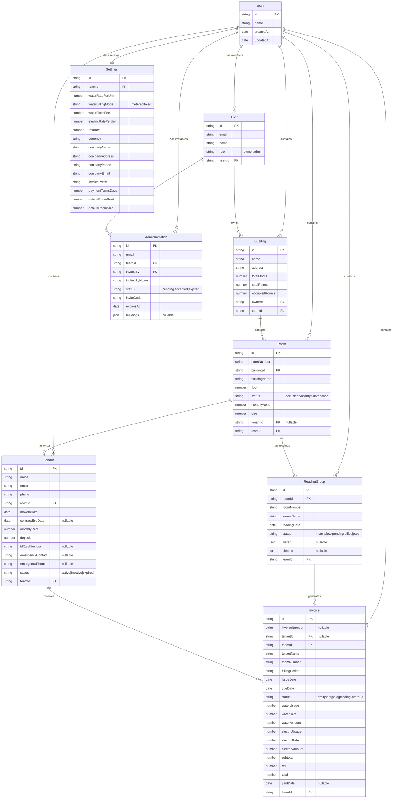

# StayKha PocketBase Architecture & Entity Relationships

## API Client Stack

1. **ofetch** – The `lib/pocketbase-api.ts` layer uses `ofetch` to communicate with `https://<VITE_POCKETBASE_URL>/api/collections/...`.
2. **TanStack React Query / Router** – Every page queries through `useQuery`/`useMutation` and the existing router tree. Data comes from PocketBase instead of the previous mock layer (`lib/api-client.ts` simply re-exports the PocketBase helpers).

## Collections / Entities

| Collection | Key Attributes | Notes |
|------------|---------------|-------|
| `teams` | `name` | Organization/team that owns buildings and settings |
| `users` | `email`, `name`, `role` (owner/admin), `teamId` | Built-in PocketBase collection with custom `role` and `teamId` fields |
| `buildings` | `name`, `address`, `totalFloors`, `totalRooms`, `occupiedRooms`, `ownerId`, `teamId` | Owned buildings belong to a team |
| `rooms` | `roomNumber`, `buildingId`, `buildingName`, `floor`, `status`, `monthlyRent`, `size`, `tenantId`, `teamId` | 1 building ➜ many rooms; status indicates occupancy; `teamId` required for team isolation |
| `tenants` | `name`, `email`, `phone`, `roomId`, `moveInDate`, `monthlyRent`, `deposit`, `status`, `teamId` | Links back to a single room and inherits rent/deposit info; `teamId` required for team isolation |
| `reading_groups` | `roomId`, `roomNumber`, `tenantName`, `readingDate`, `status`, `water`, `electric`, `teamId` | Each record stores grouped water/electric readings for a room-month; `teamId` required for team isolation |
| `invoices` | `tenantName`, `roomNumber`, `billingPeriod`, `issueDate`, `dueDate`, `status`, `total`, `waterUsage`, `electricUsage`, `teamId` | Tracks billing lifecycle; `status` matches the existing enum; `teamId` required for team isolation |
| `settings` | `teamId`, all fields from `AdminSettings` (rates, currency, company data, default rent/size) | Per-team settings collection (one record per team) |
| `admin_invitations` | `email`, `teamId`, `invitedBy`, `invitedByName`, `status`, `inviteCode`, `expiresAt`, `buildings` | Manages admin invitation workflow per team |

## Entity Relationship Diagram

## Relationships

- **Team ↔ User:** `users.teamId` links users to their team. Teams can have multiple members (owners and admins).
- **Team ↔ Building:** `buildings.teamId` links buildings to their team. All buildings in a team belong to that organization.
- **Team ↔ Room:** `rooms.teamId` links rooms to their team. Required for team isolation and access control.
- **Team ↔ Tenant:** `tenants.teamId` links tenants to their team. Required for team isolation and access control.
- **Team ↔ ReadingGroup:** `reading_groups.teamId` links meter readings to their team. Required for team isolation and access control.
- **Team ↔ Invoice:** `invoices.teamId` links invoices to their team. Required for team isolation and access control.
- **Team ↔ Settings:** `settings.teamId` links settings to a team. Each team has its own settings (one record per team).
- **Team ↔ AdminInvitation:** `admin_invitations.teamId` links invitations to a team. Admins are invited to specific teams.
- **User ↔ Building:** `buildings.ownerId` points to the owning user. Users with `role = "owner"` can own multiple buildings within their team.
- **User ↔ AdminInvitation:** `admin_invitations.invitedBy` references the user who created the invitation.
- **Building ↔ Room:** `rooms.buildingId` points to the owning building. The UI uses this to show occupancy counts.
- **Room ↔ Tenant:** `tenants.roomId` links to a room. A room can have 0 or 1 tenant. Assigning/removing a tenant updates this field via `tenantsApi`.
- **Room ↔ ReadingGroup:** `reading_groups.roomId` links to a room. Each monthly group record stores both water and electric meter values so billing can summarize a single row.
- **ReadingGroup → Invoice:** Invoices are generated from grouped readings. PocketBase doesn't run this logic automatically; the client computes totals and stores results in `invoices`.
- **Tenant ↔ Invoice:** `invoices.tenantId` optionally links to a tenant. Invoices can exist without a tenant record (using `tenantName` instead).

## Collection Field Details

For detailed field definitions, access rules, and setup instructions, see:
- **[SETUP_GUIDE.md](../SETUP_GUIDE.md)** - Step-by-step setup guide with complete field definitions
- **[README.md](../README.md)** - Project overview and quick reference

### Collections Summary

| Collection | Key Fields | Purpose |
|------------|------------|---------|
| `users` | `email`, `name`, `role` (owner/admin) | User authentication and authorization |
| `buildings` | `name`, `address`, `totalFloors`, `totalRooms`, `occupiedRooms`, `ownerId` | Building management |
| `rooms` | `roomNumber`, `buildingId`, `floor`, `status`, `monthlyRent`, `size`, `tenantId`, `teamId` | Room management; `teamId` required for team isolation |
| `tenants` | `name`, `email`, `phone`, `roomId`, `moveInDate`, `monthlyRent`, `deposit`, `status`, `teamId` | Tenant management; `teamId` required for team isolation |
| `reading_groups` | `roomId`, `readingDate`, `status`, `water`, `electric`, `teamId` | Meter reading groups; `teamId` required for team isolation |
| `invoices` | `roomId`, `billingPeriod`, `status`, `total`, `waterUsage`, `electricUsage`, `teamId` | Invoice management; `teamId` required for team isolation |
| `settings` | `teamId`, rates, company info, defaults | Per-team settings (one record per team) |
| `admin_invitations` | `email`, `invitedBy`, `status`, `inviteCode`, `expiresAt` | Admin invitation workflow |

**Access Rules:** All collections implement role-based and team-based access control:

- **Role Requirements**: Only users with `role = "owner"` or `role = "admin"` can access data
- **Team Isolation**: Users can only access data belonging to their own team (`teamId = @request.auth.teamId`)
- **CRITICAL**: All collections (rooms, tenants, reading_groups, invoices) MUST have a `teamId` field to enforce team isolation at the database level
- **Owner Privileges**: Only owners can create/update/delete teams, buildings, and settings
- **Admin Privileges**: Admins can view and update (but not delete) rooms, tenants, readings, and invoices within their team
- **Data Isolation**: All data is scoped by `teamId` to prevent cross-team access. Without `teamId` fields, admins from different teams could access each other's data.

For detailed access rules per collection, see [SETUP_GUIDE.md](../SETUP_GUIDE.md).

## Using the Setup

1. Set `VITE_POCKETBASE_URL` in your `.env` to point to your PocketBase server (e.g., `http://127.0.0.1:8090`).
2. Start the app via `pnpm dev` (after `pnpm install` to pick up `ofetch`).
3. The TanStack routes (e.g., `/dashboard/buildings`) continue to call `buildingsApi`/`roomsApi` etc.; those helpers now forward to PocketBase through `ofetch`.

## Next Steps

- Align your PocketBase schema migrations with the ER above so each collection exposes the expected fields.
- Configure SMTP settings in PocketBase for email-based features (password reset, email verification).
- Set up CORS in PocketBase settings if running frontend on a different domain/port.

## Documentation References

- **[SETUP_GUIDE.md](../SETUP_GUIDE.md)** - Complete step-by-step setup guide with all field definitions
- **[README.md](../README.md)** - Project overview, features, and quick start
